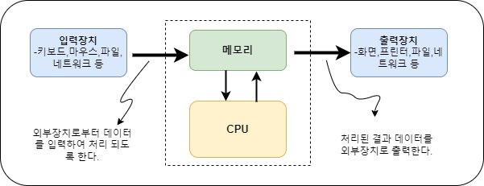
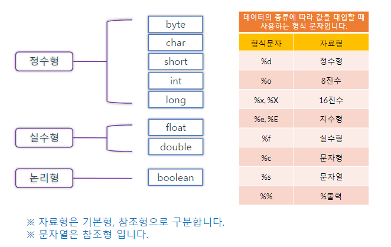
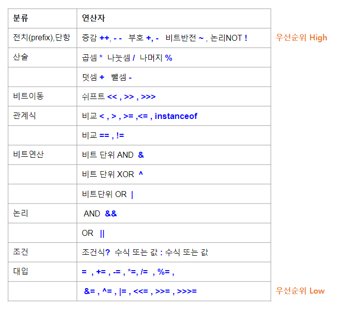

## 프로그래밍 기본 문법

 * 프로그래밍 언어의 종류에 따라 형식(문법)은 다르지만 기본적이 개념은 동일합니다.
 * 프로그래밍 언어의 기본이 되는 내용은 데이터 형식, 변수, 제어문, 배열 등이 있습니다.
 * 자바 언어의 기본 문법을 숙지 하도록 합시다.

 

 
### 데이터 처리 과정

  * 프로그램은 위의 데이터 처리과정을 실행하는 명령어들로 작성됩니다.
    * 외부 입력장치로부터 데이터를 가져와 메모리에 저장하여 필요한 기능을 처리하고 그 결과를 외부 출력장치로 전송합니다.
  * 입력장치 중 키보드와 출력장치 중 화면장치는 `표준입출력장치`이며 이 2가지 기능을 갖고 있는 것이 콘솔입니다.  

### 데이터의 형식

  * 정수 : 메모리에 저장되는 크기(용량)에 따라 4가지
    - byte : 1바이트.   `저장할수 있는 데이터의 범위 : -128 ~ 127`
    - short : 2바이트   `저장할수 있는 데이터의 범위 : -32768 ~ 32767`
    - int : 4바이트. 정수의 기본 형식입니다. `저장할수 있는 데이터의 범위 : -2147483648 ~ 2147483647`
    - long : 8바이트    `저장할수 있는 데이터의 범위 : -9223372036854775808 ~ 9223372036854775807`

  * 실수 : 메모리에 저장되는 크기(용량)에 따라 2가지
    - float : 4바이트. `저장할수 있는 데이터의 범위 : 1.4E-45 ~ 3.4028235E38`
    - double : 8바이트. 실수의 기본 형식입니다. `저장할수 있는 데이터의 범위 : 4.9E-324 ~ 1.7976931348623157E308`
  
  * 논리값 : `참` 또는 `거짓`의 값을 저장합니다.
    - boolean  : ? 

  * 문자 : 문자 1개를 저장합니다. 작은 따옴표 (') 안에 문자를 표기합니다.
    - char : 2바이트. `저장할수 있는 데이터의 범위 : 0 ~ 65535` 
    - 키보드로 입력할 수 있는 문자는 정해진 코드값을 갖습니다. char은 문자를 저장하는 것이 목적이나 문자는 코드값 즉 정수로도 표현될 수 있습니다. 자바에서 char 은 유니코드 방식으로 다국어 문자를 저장합니다. 

  * 문자열 : 문자가 여러 개 나열된 형태입니다. 자바에서는 문자열은 객체로 취급하는 참조형 데이터 형식입니다.

### 기본(primitive)형 데이터 타입

  

  * 기본형식 데이터의 저장은 그 형식을 지정하기 위해 byte,short,int,long,float,double,char,boolean 등의 키워드를 사용합니다.
  * 참조형 데이터의 저장은 클래스와 객체를 사용하며 자세한 내용은 다음 진도에서 합니다.

### 리터럴

  * 데이터의 값을 표현
  * 120 , 12 , 9999 는 `int` 형식의 정수  리터럴
  * 120L, 12L, 9999L 은 `long` 형식의 정수 리터럴
  * 012 , 077 은 `8진수 int` 형식의 정수 리터럴
  * 0x12 , 0xF28 는 `16진수 int` 형식의 정수 리터럴
  * 3.141592653589 , 1.234 는 `double` 형식의 실수 리터럴
  * 3.1415f , 1.234f 는 `float` 형식의 실수 리터럴
  * 'a' '1' 'X' '*' 는 `char` 형식의 문자 리터럴.'' 안에는 반드시 1개의 문자가 있어야 합니다.
  *  '\u0041' 는 문자 `char` 를 유니코드값을 16진수로 표현하는 리터럴 (한글은 '\uAC00'부터 '\uD7A3')
  * \t , \n  등과 같이 \(역슬래쉬)로 시작하는 표현은 `이스케이프 문자` 라고 특수한 동작을 실행합니다.

### 변수 

  * 변수 `선언` : 메모리에 데이터를 저장하기 위한 공간을 할당 받습니다. 아래 예시에서 age, weight 는 저장공간을 참조하는 이름으로 `변수명` 이라고 합니다
  * 자바 컴파일러는 명시적으로 자료형을 선언한 변수만 처리할 수 있습니다.
        
        int age;
        double weight;

  * 대입 : 데이터를 할당 받은 메모리 공간에 저장합니다. 기본적으로 선언된 형식과 리터럴의 형식이 일치해야 합니다.예외적인 경우는 있으며 다음 진도에서 다루겠습니다.

        age = 23;
        weight = 55.34;

  * 변수의 선언과 대입을 동시에 하여 변수 `초기화`를 할 수 있습니다.

        int age=23;
        double weight =55.34  

### 연산자

  * 데이터 처리 기능을 구현하기 위한 기본 동작들 입니다.
  * 연산자 종류

### 데이터 형변환 (Casting)

  * 대입문의 = 를 기준으로 왼쪽 변수 선언의 형식과 오른쪽 리터럴의 형식이 동일해야 합니다.
  * casting 연산은 변수 선언 형식과 리터럴 형식이 같지 않을 때, 데이터 형식을 변환시킵니다.
      * 정수를 실수 형식으로 대입 할 때에는 자동 캐스팅이 가능합니다.

        double dnum = 3;    //dnum=3.0

      * 실수 리터럴을 정수 형식으로 대입 할 때에는 강제 캐스팅을 꼭 합니다. 이 때에는 데이터의 손실이 생길수 있습니다.

        int inum = (int)3.1415;   //inum=3

        inum=(int)3.6789;   //inum=3

      * 데이터 형식을 크기 순으로 나열하면 
        
        byte < short < int < long < float < double
        - 자동 캐스팅은 큰 크기 변수에 작은 크기의 리터럴을 넣을 때 가능하다.
        - 강제 캐스팅은 작은 크기 변수에 큰 크기의 리터럴을 넣을 때 해야한다.
        - char 는 0~65535 범위의 값을 저장하므로 int형 이상으로 자동 캐스팅이 가능하다.
