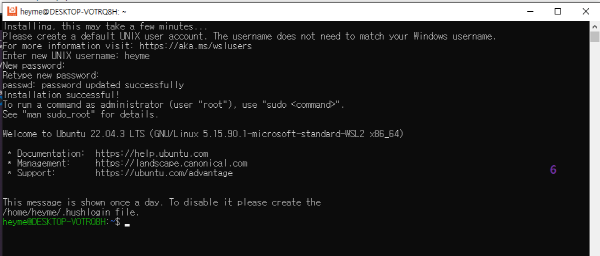

## WSL 

 * `리눅스용 윈도우 하위 시스템(Windows Subsystem for Linux, WSL)`
 * 별도의 가상 머신 또는 이중 부팅 없이 Windows 컴퓨터에서 Linux 환경을 실행할 수 있는 Windows의 기능입니다. WSL은 Windows와 Linux를 동시에 사용하려는 개발자에게 원활하고 생산적인 환경을 제공하도록 설계되었습니다. [마이크로소프트](https://learn.microsoft.com/ko-kr/windows/wsl/about)
    - Unix와 같은 명령줄 셸을 사용하여 Windows 애플리케이션을 호출합니다.
    - Windows에서 GNU/Linux 애플리케이션을 호출합니다.
    - Windows 데스크톱에 직접 통합된 GNU/Linux 그래픽 애플리케이션 실행

 * [위키백과](https://ko.wikipedia.org/wiki/%EB%A6%AC%EB%88%85%EC%8A%A4%EC%9A%A9_%EC%9C%88%EB%8F%84%EC%9A%B0_%ED%95%98%EC%9C%84_%EC%8B%9C%EC%8A%A4%ED%85%9C)
    - 윈도우 10과 윈도우 11에서 네이티브로 리눅스 실행 파일(ELF)을 실행하기 위한 호환성 계층이다. 
    - WSL은 리눅스 커널 코드가 포함되지 않은, 마이크로소프트가 개발한 리눅스 호환 커널 인터페이스를 제공하며, 그 위에 리눅스 유저랜드를 실행시킬 수 있는데, 이를테면 우분투, SUSE, 페도라를 들 수 있다. 이러한 유저랜드는 배시 셸과 명령 언어를 포함할 수 있으며, 네이티브 리눅스 명령 줄 도구(sed, awk 등)들과 프로그래밍 언어 인터프리터(루비, 파이썬 등)가 내장된다.
    - 마이크로소프트는 WSL을 "특히 웹 개발자와 오픈 소스 프로젝트로 일하는 사람들처럼 개발자들을 위한 주요 도구"로 바라보고 있다.WSL은 완전히 가상화된 머신 보다 더 적은 자원을 사용하며 윈도우 환경에서 리눅스 소프트웨어를 통합할 수 있는 방법이면서 그와 동시에 사용자들이 동일한 파일 집합 위에서 윈도우 앱과 리눅스 도구를 사용할 수 있게 한다.

### WSL2

  * WSL2는 Linux 배포를 설치할 때 기본 배포판 유형입니다. WSL2는 가상화 기술을 사용하여 경량 유틸리티 VM(가상 머신) 내에서 Linux 커널을 실행합니다. 
  * WSL2는 WSL1 아키텍처에 비해 파일 시스템 성능을 향상시키고 전체 시스템 호출 호환성을 추가합니다. WSL 1과 WSL 2를 비교하는 방법에 대해 자세히 알아봅니다.
  * [MS 소개 동영상](https://youtu.be/MrZolfGm8Zk)

### WSL 설치

  * [마이크로소프트 공식](https://learn.microsoft.com/ko-kr/windows/wsl/install)

  *  windows powershell 실행-관리자 권한으로 실행하세요.

  

  * 현재 설치된 WSL 시스템 확인 - 아래 그림처럼 기본값 외에 항목이 있으면 이미 설치된 것입니다. 

  

  * 설치된 경우 버전도 확인해 보세요.
  
  

  * 이미 설치되어 있으면 아래 과정은 Skip~!

#### 필수 조건

`아래 명령을 사용하려면 Windows 10 버전 2004 이상(빌드 19041 이상) 또는 Windows 11을 실행해야 합니다. 이전 버전을 사용 중인 경우 수동 설치 페이지를 참조하세요.` 라고 되어있는데 확인해본바 버전은 요건에 충족되지만 예전에 wsl --install 로하다가 오류가 났던것 같아 [이전 버전 WSL의 수동 설치 단계](https://learn.microsoft.com/ko-kr/windows/wsl/install-manual)로 했습니다. 시스템 상태에 따라 성공여부가 다를 것이니 여러분은 공식 페이지 안내대로 해보세요.

#### 윈도우기능 설정

#### step 1. Linux용 Windows 하위 시스템 사용
#### step 2. WSL 2 실행을 위한 요구 사항 확인
  * 위의 필수조건 버전 확인 참고
#### step 3. Virtual Machine 기능 사용  
  * 명령어는 직접 입력하지 말고 복사 기능 이용하세요.

#### step 4. Linux 커널 업데이트 패키지 다운로드

#### step 5. WSL 2를 기본 버전으로 설정

#### step 6. 선택한 Linux 배포 설치

#### windows terminal 설치하기
  * 기존 power shell 보다 기능이 향상되어 여러 종류의 터미널을 다중으로 사용할 수 있습니다.

  

  

#### 윈도우에서 wsl 파일 공유하기
  * 파일탐색기 주소창에서 입력하기

##### 문제해결
  * https://ymister.cafe24.com/textcube/1010
